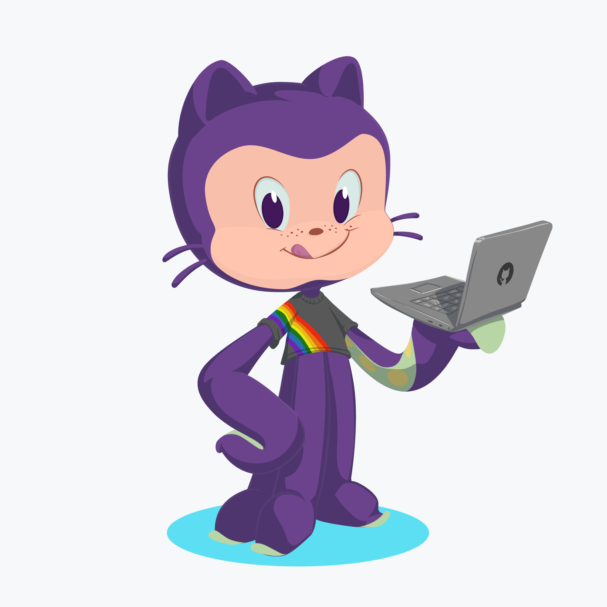

### Hi there, I'm Ami 👋

[Check out my portfolio!](https://www.amiscott.com/)\
[Find me on Twitter](https://twitter.com/AmiEzraScott)\
[I'm also on LinkedIn!](https://www.linkedin.com/in/ami-scott/)

- 🔭 I’m enjoy working with: JavaScript, React, CSS
- 🌱 I’m currently learning: React Native
- 💬 Ask me about: my cats 🐈
- 😄 Pronouns: they/them
- ⚡ Fun fact: A cat cannot see directly under its nose.

<!--
**Memitaru/Memitaru** is a ✨ _special_ ✨ repository because its `README.md` (this file) appears on your GitHub profile.

Here are some ideas to get you started:

- 🔭 I’m currently working on ...
- 🌱 I’m currently learning ...
- 👯 I’m looking to collaborate on ...
- 🤔 I’m looking for help with ...
- 💬 Ask me about ...
- 📫 How to reach me: ...
- 😄 Pronouns: ...
- ⚡ Fun fact: ...
-->
